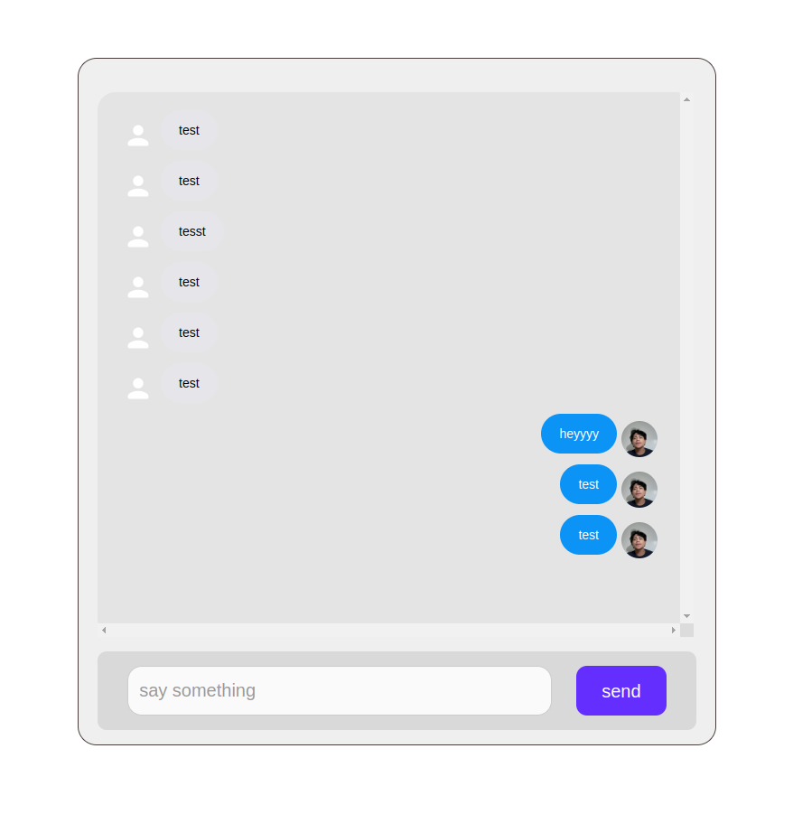
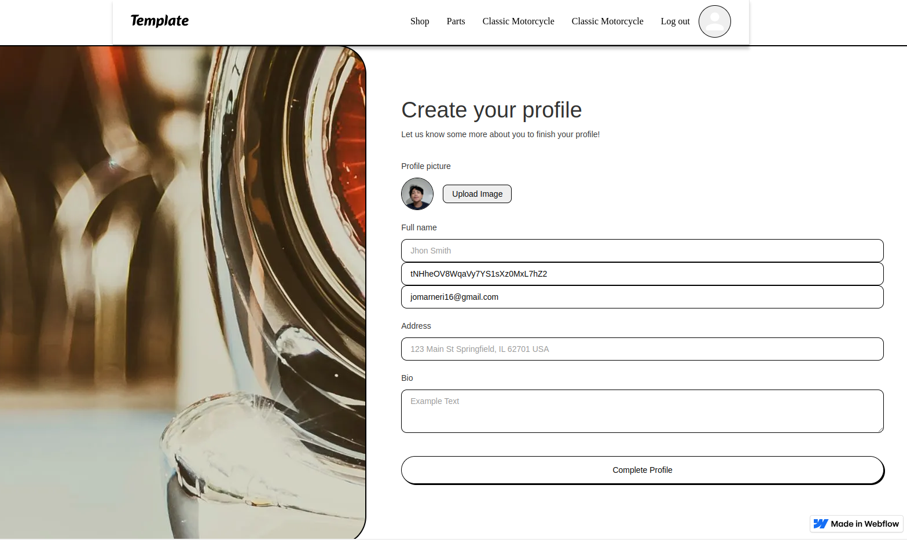
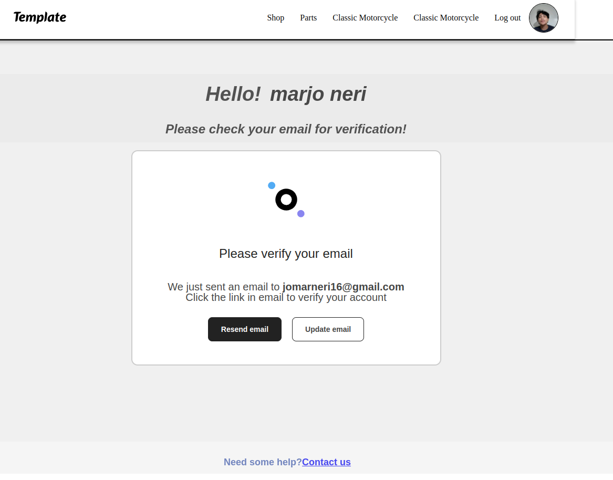

<h1>Webflow, vite, javasctipt and firebase🔥</h1>
<h3>this project is ongoaing 😊😊 i will add webflow API soon!!</h3>

## chat testing
## register and sign-in to your account
https://vintage-car-market----testing.webflow.io/chat

## chat testing


## onboarding testing


## user email authentication



## Building and running on localhost

This project is using `yarn`.

First, install dependencies:

```sh
yarn
yarn add firebase
```

To launch a local dev server:

```sh
yarn dev
```

To create a production build:

```sh
yarn build
```

To clean the local `/dist` folder:

```sh
yarn clean
```

To lint the code with ESLint and Prettier:

```sh
yarn lint:fix
```
